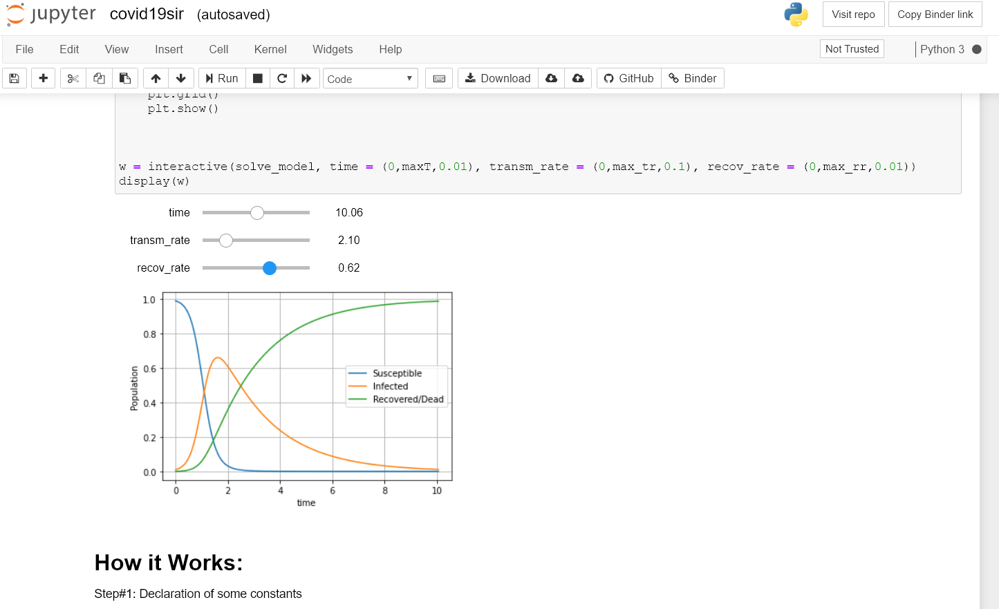

# What is mm4d?
Mathematical Models for Diseases using Standard Model of Disease Spread in Python Jupyter Notebook

To run it in binder, click this link: 
or
you can view it in readonly mode from google collab at: https://colab.research.google.com/drive/1gBYRZxgCmfBh2iUTjoju6lBMAJoP99JW

You can use this link to share its binder: https://mybinder.org/v2/gh/fslurrehman/mm4d/master
or simply download it to run locally on your jupyter lab. 

Don't forget to fork and contribute. 

# Project Detail:
In wake of COVID19, I created this repo to evaluate existing mathematical models to understand spread of diseases especially the pandemic like Corona Virus 19. It is based on the SIR (Susceptible Infected Recover) Model. Video link at no. 4 in Useful links below is helpful in understanding the differential equations of SIR model which I have used in covid19sir.ipynp.

It contains a workbook named covid19sir.ipynb. You can run this to simulate the spread of disease for given population.  It is based on numberphile youtube video which you can watch from notebook. It can be helpful in identifying key indicators like number of days/weaks after which peak will occur, number of total possible infected people etc. 

# Useful links:
1. https://www.wired.com/story/data-sharing-open-source-software-combat-covid-19/
2. https://www.wired.com/story/phones-track-spread-covid19-good-idea/
3. After 6 hours of making this repo, 3Blue1Brown uploaded a very useful video on detailed simulation of epidemics. The source code of his simulation is at: https://github.com/3b1b/manim/blob/shaders/from_3b1b/active/sir.py while animation engine for his video can be found at: https://github.com/3b1b/manim whose pre-requisite requirements seems to be difficult to install. Also there is some info regarding outbreak at: https://meltingasphalt.com/interactive/outbreak/. It is worth watching the 3Blue1Brown video which is at: https://www.youtube.com/watch?v=gxAaO2rsdIs 
4. More explanation of SIR model from mathematical point of view. This video is useful in understanding differential equations used in SIR model. 

# todo:
1. Adding description of modules and explanation for code. 
2. Adding more plots to comparison of data of other country or region.
3. Adding more models other than (SIR)
4. Highlighting key indicators/outputs
5. Adding useful links for data on diseases

